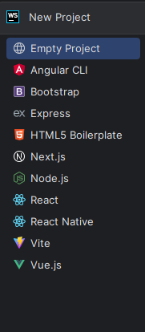
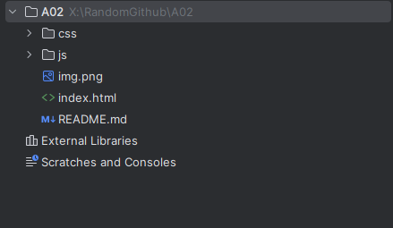

# Git, GitHub, Webstorm, and You

## A guide to using Git and GitHub with Webstorm

**By:** Alfred Simpson <br>
**Date:** 09/29/2023

# Overview

This guide will walk you through the process of using Git and GitHub with Webstorm. It will cover the following topics:

- Webstorm
    - What is Webstorm?
    - Downloading Webstorm
    - Installing Webstorm
    - Creating a project in Webstorm
    - Creating a new file (or two)
- Git
    - What is Git?
    - Why use Git?
    - Installing Git
- GitHub
    - What is GitHub?
    - How is it different from Git?
    - Creating a GitHub account
- Tying it all together
    - Configuring Git
    - Creating a repository on GitHub
    - Cloning the repository in Webstorm
    - Making changes to the repository
    - Committing changes
    - Pushing changes to GitHub
    - Pulling changes from GitHub

As I am in an extra wordy mood, I'll save you some time and hide each section behind a toggle menu. Click the arrow to
expand the section and read more for each section.

# Contents

- [Webstorm](#part-one-webstorm)
- [Git](#part-two-git)
- [GitHub](#part-three-github)
- [Tying it all together](#part-four-tying-it-all-together)
- [Glossary](#glossary)
- [References](#references)

# Part One: Webstorm

<details>
<summary> Read all about it!</summary>

## What is Webstorm?
Webstorm is a JavaScript IDE (Integrated Development Environment) developed by JetBrains. It is a powerful tool that allows you to write, edit, and debug code in a single application. It also has built-in support for Git and GitHub, which makes it a great tool for working on projects that use Git and GitHub. While other editors exist, such as VisualStudio Code, those are actually just text editors with extensions that add IDE-like functionality. Webstorm is a true IDE, and as such, it is the best tool for the job. Maybe - I don't know, I'm not your mom. Use whatever you want. 

## Downloading Webstorm

You can download Webstorm directly from [JetBrains' website](https://www.jetbrains.com/webstorm/). It is free for
students, and you can get a [free student license](https://www.jetbrains.com/community/education/#students/) by signing
up with your school email address. Once you have downloaded and installed Webstorm, you can open it up and get started.

As a side note: While JetBrains offers a student license, it must be renewed annually. Failure to renew can result in
your license being revoked. If you are no longer a student, you can purchase a license for Webstorm. If you still are a
student and let your license lap, it will give you a headache trying to get it back. Trust me. In the case that you do
lose your license and need to download Webstorm for a class like IS-117 at NJIT, start
by [contacting their support team](https://www.jetbrains.com/support/). When that
fails, [contact their sales team](https://www.jetbrains.com/support/sales/#email-sales) and explain your situation. They
will likely ask you to provide proof that you are a student, such as a transcript or a copy of your student ID. Once you
have done that, they will give you a new license. Hopefully, anyway - Many of my peers experienced long delays in
getting their licenses renewed.

## Installing Webstorm

Once you have your license and you downloaded Webstorm, installation is simple. Double-click the file you downloaded and
follow the on-screen instructions. Once it is installed, you can open it up and get started.

## Creating a project in Webstorm

When you first open Webstorm, you will be greeted with a welcome screen. From here, you can create a new project, open
an existing project, or check out a project from a version control system. For now, we will create a new project.

As you create a new project, you'll notice that it gives you options for project types.<br>


To get in the habit of doing so, I chose Bootstrap. If you're also taking IS-117 with Dr. Hendela at NJIT, it's likely
that you will need to use Bootstrap eventually as well. Get in the habit of creating a new project with Bootstrap now,
and you'll save yourself some time later. Once you select your project type (or didn't), just add a name and click "
Create".

It should look like this if you chose to get started with Bootstrap like I did:

Of course, your directory and file name will be different. Do what feels right for you.

If you don't add it, there are other ways to import bootstrap to your project. You can do so by importing it from a CDN,
or by downloading the files and adding them to your project manually. However, if you're going to be using Bootstrap
anyway, you might as well add it now. Right? Right.

Now that you've created your project, and if you imported Bootstrap, you should see something like this:
<br>

<br>
However, you'll notice I have a few extra files in my project. That's because I'm taking screenshots after the fact.
Let's get you caught up to speed.

### Creating a new file (or two)

To create a new file, right-click on the directory you want to create it in, and select "New" -> then select the file
type you want to create. I have an index.html file and README.md file in my project.


If you click HTML file, it will create a prompt you to name the file. I chose index.html. All you need to type is
index - it will add the .html at the end. You can now edit the file to say whatever you want.
<br>

<br>
The README.md was my own addition. You're reading it now. Or in the future. I'll be in the past when you read this. But
hopefully still present. Time is wibbly-wobbly.

But you'll notice I did not have an option for creating a markdown file. That's okay - all you need to do is create a
new file and name it README.md. It will automatically be a markdown file.

### But what's the img.png file?

I'm glad you asked, me. I'm using it to show you why Webstorm makes sense to use for projects like this.

First off, naming a file img.png is a bad idea. It's not descriptive, and it's not helpful. But I'm using it to show you
how Webstorm handles images. Now, editing an image or file name isn't as easy as right-clicking on the file and
selecting rename.
<br>


<br>

I mean, it is -> but it's not in the main context menu. Instead, we have shift+F6. That's a hotkey that allows you to
rename it.

When renaming a file, it will also rename the image in the file it's found in! That's pretty neat.


But what if you want to move the image to a different directory? Well, you can do that too. Just drag and drop it into
the directory you want it to be in. It will automatically update the file path in the file it's found in.

Before:
<br>


<br>

After:


<br>

<br>

Even better. 

Now that we've covered the basics of Webstorm, let's move on to Git. You just learned how to create a project, but the last thing we'd want is for something to happen to it.
</details>

# Part Two: Git

<details>
<summary> Read all about git!</summary>

## What is Git?

[Git](#git) is a version control system. 
It allows you to track changes to files and directories over time. **Version control?** Yes, version control. Ever work on a project, and you didn't realize you were about to do something that would break **everything**? Or maybe it was working a few minutes ago, and now it's not. We've all been there. I have. Often. I accidentally broke NICC's entire website at 1 am the night before a big event. If I didn't have version control in place, I would have been having _a bad time_.

Version controlling is just a way to make sure that you can always take a few steps back when you need to. Imagine having version control for conversations? Amazing. I'd love that. Except git exists - and my imaginary time machine for conversations does not.


## Why use Git?

Well, after learning about what Git is - why wouldn't you use Git? Git allows you to revert your changes. Git allows you to work with others seamlessly. Most importantly, Git allows you to fix your mistakes. Providing, of course, that you follow the golden rules of Git:

- Commit early
- Commit often
- Leave good commit messages
- If you make a change & it works: Commit and leave a message saying what you did.
- If you make a change & it doesn't work: ~~pretend someone else did it~~ Fix it locally, leaving comments as to why it didn't work.
- Don't work in production or live code.
- Don't work in production or live code.
- Don't work in production or live code.

If you follow these rules, you'll be fine. If you don't, you'll be fine until you're not. Which isn't great, but you'll learn like all of us do - by breaking and rebuilding things.

## Installing Git

Are you on Linux? Fantastic! Use your favorite package manager to install Git. On most Debian distributions, a simple:
```sudo apt install git``` will do the trick.

Are you on Windows or Mac? That's cool, too! You can download Git from [Git's website](https://git-scm.com/downloads).

Simply download and install Git. It's that easy.

Of course, you'll need to actually configure your Git to work appropriately. We'll cover that in the next section.

</details>

# Part Three: GitHub

<details>
<summary> Read all about GitHub!</summary>

Okay, so you have Webstorm installed and now Git is active on your machine. You know you want to use version control because it's amazing - but where are you hosting your code? You could use [GitLab](https://about.gitlab.com/), Atlassian's [BitBucket](https://bitbucket.org/product), any other number of services. While I have personally noticed people speaking about GitLab more often lately, it still is not the go-to Git Repository. A very large majority of the world is using GitHub, and we are, too.  

## What is GitHub?

GitHub is a web-based Git repository. It's used by private people like, or Enterprises like [Microsoft](https://github.com/microsoft). In fact, GitHub has been owned by Microsoft since 2018 (Source: [New York Times](https://www.nytimes.com/2018/06/04/technology/microsoft-github-cloud-computing.html)). Can you believe they paid $7.5 Billion for GitHub? I can. Here's why:

GitHub lets you host your code remotely and is a great place to examine open-source coding projects. It's used by over 100,000,000 people as of January 2023. (Source: [GitHub Blog](https://github.blog/2023-01-25-100-million-developers-and-counting/)).

## How is it different from Git?

But wait, why do we need something like GitHub if we have Git? Git lets us version control, but GitHub lets us do so remotely. It also lets us work with others on projects. It's a great way to collaborate with others on projects. GitHub uses Git. Git does not use GitHub. At least, not that I could find.

SimpliLearn actually gives a really good explanation of the difference between Git and GitHub. "While they both provide source code management (SCM) and make merging and sharing code easier, this is pretty much where their similarities end. Think of Git as a single computer and GitHub as a network of multiple interconnected computers, all with the same end goal but a wildly different role to get there." (Source: [SimpliLearn](https://www.simplilearn.com/tutorials/git-tutorial/git-vs-github#git_and_github_operate_completely_differently)


## Creating a GitHub account

To create a GitHub account, you'll just need to go to GitHub's site. You can do so by clicking [here](https://github.com/). From there, click on signup, and you'll see a screen like this: <br>


<br>

Follow the prompts to get started. Eventually you will have your very own GitHub account. As a side note: make sure to use your .edu email if you're signing up for the first time. They do offer pretty sweet [education deals](https://education.github.com/). 
</details>

# Part Four: Tying it all together

<details>
<summary> Read how this all ties together!</summary>

## Make it all work!

Now that we know what Git is and created our GitHub account, let's tie it all together. We'll need to configure our accounts, create the repository, and then push it.

## Configuring Git & GitHub

To configure Git on your local machine for GitHub. Open up your favorite terminal or, using Webstorm, open up the terminal. You can press Alt+F12 to do so on Windows. 
You'll need to run the following commands:

```git config --global user.name <Your Github User Name>```

For example, mine is:
```git config --global user.name AlfredSimpson```

Next, configure your email address. Use the same from your GitHub account.
```git config --global user.email <email address>```


## Initialize a repository

Great, that's set up. Now we should initialize our repository. This means to basically take wherever we're working and configure it to be a place where we can use Git.

To do so, use:
```git init```
Note: Make sure you're in the directory where your work is.  I'm working in X:\RandomGithub\A02, so it looks like this:


## Creating a repository on GitHub

We've initialized our repository. Now we are going to go much faster. 

### Create your branch
We're going to switch to a new branch main using the following code:

```git checkout -b main```
Note: A branch is where we're developing everything! Older terminology may use master, but that's outdated and a bit racist. I use main. You can call yours Billy. Whatever you'd like, it really doesn't matter.
Additional note: You can also initialize a repo and automatically be in the branch using ```git init -b main```.

### Add your files

What good is version controlling if you don't add things to control? Add all files you want to version control either individually, or by using:
``` git add --all``` or ```git add -A```

You'll probably see some lovely warnings the first time you do this:


That's okay. Don't worry about it. LF stands for line feed. CRLF stands for carriage return line feed. It's a line ending. It's a thing. It's not a big deal. It's just a warning. You can ignore it. It's just letting you know that it will make changes. It's not a big deal.

If you didn't use git add -A, and you used git add --all, you'd see the same thing. I don't have a screenshot for that, but I promise it's the same thing.


### Commit your changes

We've initialized git. The files are added. Now we need to commit.

```git commit -m "Your commit message here"```

I used:


### But where is it?

We committed the changes, but where did they go?
Nowhere. We need to send them to GitHub.

So let's create a GitHub repository through command line. Make sure you're using Git Bash for this.

```gh repo create```


Oh, no. An error! That's okay. We just need to go download the GitHub [Command Line Interface](https://cli.github.com/).

Download that and install it. Then, authorize it using the following command:

```gh auth login```


Follow the prompts!

I chose to use GitHub.com, and SSH for Git Operations. I then selected my SSH public key.

If you don't have an SSH key and would like to do the same... You can follow [GitHub's instructions](https://docs.github.com/en/github/authenticating-to-github/connecting-to-github-with-ssh) on how to do so. 

Now, with **that** done, let's try again.

```gh repo create```

You'll get a lot of prompts asking you to provide a repository name, description, etc. Enter it all, and follow the prompts until it creates the repository. I didn't screenshot this for you as it did contain private data of my own. 


### Finally, push it!

Don't stop, push it! Push it real good!

Since we did this in a way that takes way more time than most people would, we'll need something more than just a regular git push... Go over to GitHub and you'll find you have a brand new public repo! Take the URL, and use it in the following command:

```git remote add origin <URL of your github repo>```
Check that it's there using ```git remote -v```

Now, we can push it!

```git push -u origin main```


It's a beautiful thing to see.

## The... easier way.

Okay, so that was a lot. I'm not going to lie. It was a lot. But it's a good way to learn. However, there is an easier way.

Since you have a GitHub account created, all you really needed to do was create a repository on GitHub. Then, clone it in Webstorm. You can do so by clicking on "Get from Version Control" on the welcome screen.

You could have also used the git clone command in the terminal. 

```git clone <URL of your github repo>```

Then, you could have made your changes, committed them, and pushed them.

But where's the fun in that? You wouldn't have learned anything. I learned something - because things broke! And now you maybe learned from my mistake. Or you didn't! Who knows? 

## What about pulling?

Let's say you're working on a project with someone else. They make a change, and you need to pull it. You can do so using the following command:

```git pull```

That's it. That's all you need to do. It will pull the changes from the remote repository to your local machine. Just make sure that you're in the right directory when you do so.


</details>

# Glossary

<details>
<summary> Learn the words I used that you might have gotten lost on</summary>

Some definitions were known to me, and one or two were not. However, when possible, I chose to include an official definition from Git or other sources. Sometimes only because I thought it was funny and clearly written by a developer who couldn't see the forest for the trees. When it was overly technical, I wrote a more simple definition.

### Branch

A line of development.
- Source: [Git](https://git-scm.com/docs/gitglossary#Documentation/gitglossary.txt-aiddefbranchabranch)<br>

A version of a version-controlled project that enables you to work on multiple projects simultaneously and, if you want, with other people, without potentially catastrophic damage done to the codebase. 
- Source: Me<br>

### Clone

A clone is a copy of a remote repository on your local machine. Used in command-line as <br>
```git clone <url>```
- Source: Me

### Commit

noun: A single point in the Git history;
<br>
verb: The action of storing a new snapshot of the project's state in the Git History;
- Source: [Git](https://git-scm.com/docs/gitglossary#Documentation/gitglossary.txt-aiddefcommitacommit)

### Fetch

"Fetching a branch means to get the branch’s head ref from a remote repository, to find out which objects are missing from the local object database, and to get them, too."
- Source: [Git](https://git-scm.com/docs/gitglossary#Documentation/gitglossary.txt-aiddeffetchafetch)

In other words: Get the most recent version of everything in a repository and make sure nothing is missing.
- Source: Me

### Git
A free and open source distributed version control system designed to handle everything from small to very large projects with speed and efficiency. <br> 
- Source: [Git](https://git-scm.com/)

A foolish or worthless person <br>
- Source: [Merriam-Webster](https://www.merriam-webster.com/dictionary/git);<br>

A time machine for your code 
- Source: Me <br>

### GitHub

GitHub describes itself as the "complete developer platform to build, scale, and deliver secure software." 
- Source: [GitHub](https://github.com/about)

For all intents and purposes, it is a remote repository for your code. 
- Source: **Me**

### Merge

_verb:_ "To bring the contents of another branch or external repository into the current branch."; <br>
_noun:_ "a successful merge results in the creation of a single commit representing the result of the merge."
- Source: [Git](https://git-scm.com/docs/gitglossary#Documentation/gitglossary.txt-aiddefmergeamerge)

### Merge Conflict

"An event that occurs when Git is unable to automatically resolve differences in code between two commits."
- Source: [GitKraken](https://www.gitkraken.com/learn/git/tutorials/how-to-resolve-merge-conflict-in-git#:~:text=A%20merge%20conflict%20is%20an,merge%20commits%20without%20your%20help.)

### Pull

"To fetch and merge a branch"
- Source: [Git](https://git-scm.com/docs/gitglossary#Documentation/gitglossary.txt-aiddefpullapull) <br>

Retrieve the most recent version of a repository from a remote repository to your local machine.
- Source: Me

### Push

"Pushing a branch means to get the branch's head ref from a remote repository, find out if it is an ancestor to the branch's local head ref, and in that case, putting all objects, which are reachable from the local head ref, and which are missing from the remote repository, into the remote object database, and updating the remote head ref."
- Source: [Git](https://git-scm.com/docs/gitglossary#Documentation/gitglossary.txt-aiddefpushapush)

Send your committed changes to a remote repository. 
- Source: Me

### Remote

A non-local device or repository. In this instance, we are referring to a repository. It resides in a different location than your local machine. 
- Source: Me

### Repository

"A collection of refs together with an object database containing all objects which are reachable from the refs, possibly accompanied by metadata from one or more porcelains."
- Source: [Git](https://git-scm.com/docs/gitglossary#Documentation/gitglossary.txt-aiddefrepositoryarepository) <br>

A place where things are stored, like your code. 
- Source: Me

</details>

# References

As I'm pretty familiar with Git, I didn't need to reference many sources. However, I will add citations here as asked. All glossary terms were linked within the glossary itself. However, for ease of reference, we will link them here, too.  

- [Git Glossary](https://git-scm.com/docs/gitglossary)
- [GitHub](https://github.com)
- [GitHub Blog](https://github.blog/2023-01-25-100-million-developers-and-counting/)
- [GitHub Documentation](https://docs.github.com/en/authentication/connecting-to-github-with-ssh/generating-a-new-ssh-key-and-adding-it-to-the-ssh-agent)
- [GitHub Education](https://education.github.com/)
- [Merriam-Webster](https://www.merriam-webster.com/dictionary/git)
- [New York Times](https://www.nytimes.com/2018/06/04/technology/microsoft-github-cloud-computing.html)
- [SimpliLearn](https://www.simplilearn.com/tutorials/git-tutorial/git-vs-github#git_and_github_operate_completely_differently)

